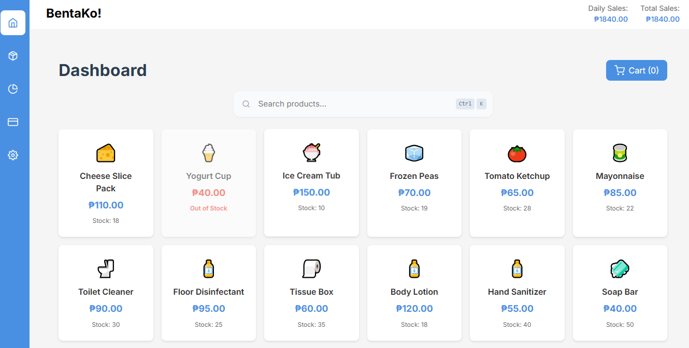
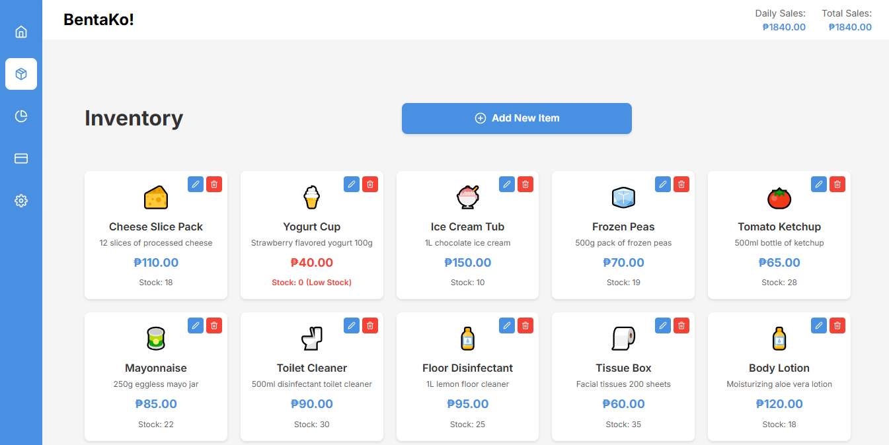
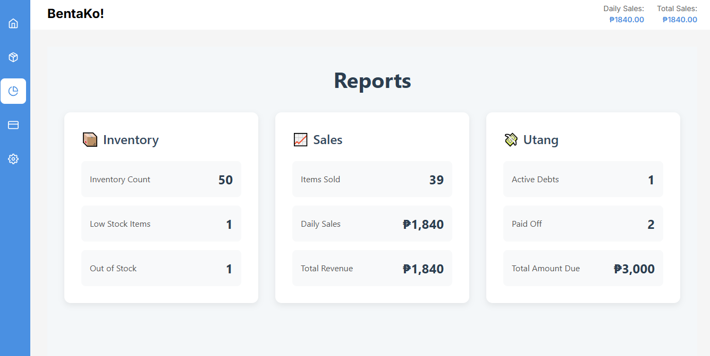
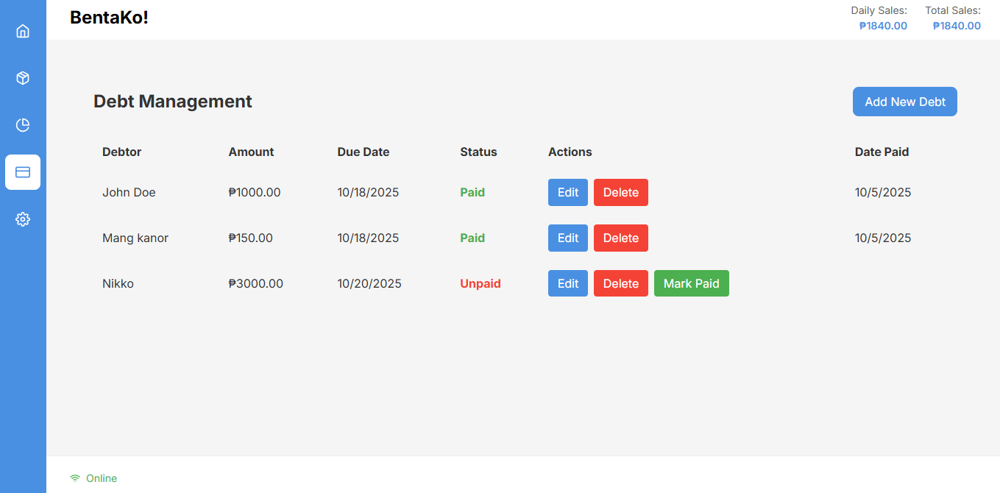

<div align="center">
  
  
  # BentaKo! - Modern Point of Sale System
  
  [](https://opensource.org/licenses/MIT)
  [](https://reactjs.org/)
  [](https://www.typescriptlang.org/)
  [](https://vitejs.dev/)
  [](https://tanstack.com/query/latest)
  
  A modern, responsive point-of-sale (POS) system built with React, TypeScript, and Vite. BentaKo! helps small businesses manage sales, inventory, and transactions with ease.
</div>

## 📱 Screenshots

| Dashboard | Inventory Management |
|-----------|----------------------|
|  |  |
| **Reports** | **Debts Management** |
|  |  |


## ✨ Features

### 🛍️ Sales & Checkout
- Intuitive product catalog with search and filtering
- Quick add to cart with quantity controls
- Real-time cart management
- Multiple payment methods support
- Receipt generation

### 📦 Inventory Management
- Real-time inventory tracking
- Low stock alerts
- Product categories and variants
- Barcode/QR code scanning support
- Import/export functionality

### 📊 Reporting
- Sales reports (daily, weekly, monthly)
- Product performance tracking
- Revenue overview
- Exportable reports (PDF, Excel)

### 💳 Customer Management
- Customer profiles
- Purchase history
- Loyalty programs
- Credit tracking (Utang system)

### 🎨 Modern UI/UX
- Responsive design (desktop & mobile)
- Dark/Light theme support
- Keyboard shortcuts
- Intuitive navigation
- Accessible interface

## 🚀 Getting Started

### Prerequisites

- Node.js 18+
- Bun (v1.1.10)
- Git

### Installation

1. Clone the repository:
   ```bash
   git clone https://github.com/Ravsalt/BentaKo.git
   cd BentaKo
   ```

2. Install dependencies:
   ```bash
   bun install
   ```

3. Start the development server:
   ```bash
   bun run dev
   ```

4. Open [http://localhost:5173](http://localhost:5173) in your browser.


## 🛠️ Tech Stack

- **Core**: React 19, TypeScript, Vite
- **State**: React Query
- **Styling**: Styled Components
- **Icons**: Lucide Icons
- **Routing**: React Router
- **Animations**: Framer Motion

## 📦 Production Build

To create a production build:

```bash
bun run build
```

The build artifacts will be stored in the `dist/` directory.

## 🧪 Testing

Run the test suite:

```bash
bun run test
```

## 🤝 Contributing

Contributions are welcome! Please follow these steps:

1. Fork the repository
2. Create a feature branch (`git checkout -b feature/AmazingFeature`)
3. Commit your changes (`git commit -m 'Add some AmazingFeature'`)
4. Push to the branch (`git push origin feature/AmazingFeature`)
5. Open a Pull Request

## 📝 License

This project is licensed under the MIT License - see the [LICENSE](LICENSE) file for details.

## 🙏 Acknowledgments

- Built with ❤️ for small business owners
- Inspired by the need for simple, effective POS solutions
- Special thanks to all contributors and open-source maintainers


## 📬 Contact

Have questions or suggestions? Feel free to [open an issue](https://github.com/Ravsalt/BentaKo/issues) or reach out to the maintainers.
