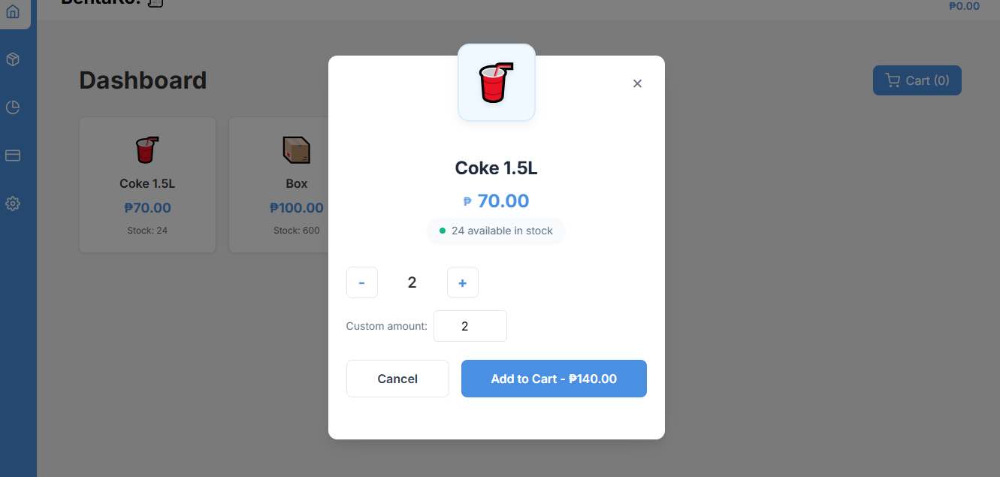

# 🧾 BentaKo! - Modern Point of Sale System





A modern, responsive point-of-sale (POS) system built with React, TypeScript, and Vite. BentaKo! helps small businesses manage sales, inventory, and transactions with ease.


## ✨ Features

- 🛍️ Intuitive product catalog and cart management
- 📊 Real-time inventory tracking
- 💰 Easy checkout process
- 📱 Mobile-responsive design
- 📈 Sales reporting and analytics
- 🔐 Secure and reliable

## 🚀 Getting Started

### Prerequisites

- Node.js 16+
- npm or yarn

### Installation

1. Clone the repository:
   ```bash
   git clone https://github.com/Ravsalt/BentaKo.git
   cd BentaKo
   ```

2. Install dependencies:
   ```bash
   npm install
   # or
   yarn
   ```

3. Start the development server:
   ```bash
   npm run dev
   # or
   yarn dev
   ```

4. Open [http://localhost:5173](http://localhost:5173) in your browser.

## 🛠️ Built With

- [React](https://reactjs.org/) - Frontend library
- [TypeScript](https://www.typescriptlang.org/) - Type checking
- [Vite](https://vitejs.dev/) - Build tool
- [React Icons](https://react-icons.github.io/react-icons/) - Icons
- [Styled Components](https://styled-components.com/) - Styling

## 📝 License

This project is licensed under the MIT License - see the [LICENSE](LICENSE) file for details.

## 🙏 Acknowledgments

- Built with ❤️ for small business owners
- Inspired by the need for simple, effective POS solutions
```
